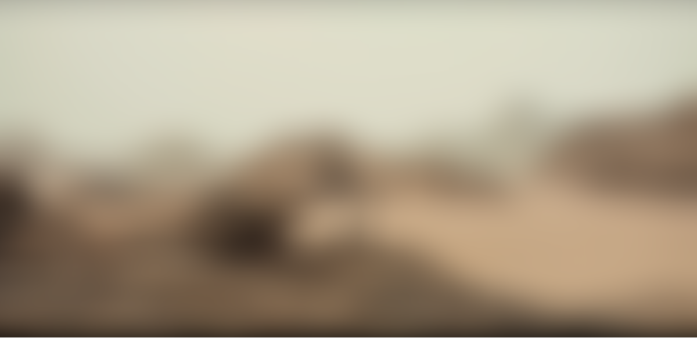
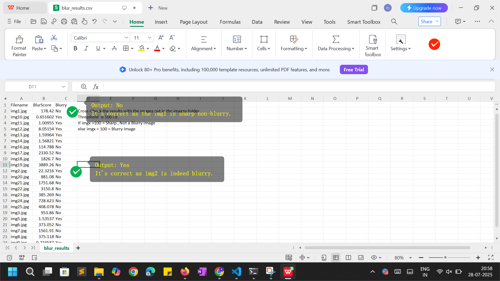

# CUDA-Blur-Detector

A **GPU-accelerated image sharpness analyzer** built using CUDA and OpenCV. It loads multiple `.jpg` images and evaluates their blur level using Laplacian variance. Results are exported to a CSV file. Designed for fast analysis of many images, especially helpful in computer vision pipelines for filtering blurry inputs.

---

## Goal

Detect **blurred images** in a directory using a fast **CUDA-accelerated Laplacian filter**, log their sharpness scores, and export them to a CSV.

---

## What It Does

- Reads all `.jpg` files from the `images/` folder.
- Computes the **Laplacian variance** (a sharpness metric) using OpenCV.
- Compares against a user-defined or fixed threshold.
- Outputs results to a file named `blur_results.csv`.

---

## Project Structure

cuda-blurrrr/
│
├── blur_detector.cu # Main CUDA + OpenCV source code
├── blur_detector.exe # Compiled executable
├── blur_results.csv # Output CSV file (generated at runtime)
├── images/ # Folder with input .jpg images
├── docs/ # Folder containing proof screenshots
└── README.md # This documentation file


---

## Dependencies

- [CUDA Toolkit 11.x or newer](https://developer.nvidia.com/cuda-toolkit)
- [OpenCV 4.1.2+ Windows Build](https://opencv.org/releases/)
- Microsoft Visual Studio 2022 (x64 Native Tools Command Prompt)

---

## Build Instructions

> Make sure you’re using the **x64 Native Tools Command Prompt for VS 2022**.

### 1. Navigate to the project folder:
```cd C:\Users\Anya\Downloads\cuda-blurr```

### 2. Run this command i.e. Compile using nvcc: 
nvcc blur_detector.cu -o blur_detector.exe -std=c++14 ^
 -IC:\Users\Anya\Downloads\opencv\build\include ^
 -LC:\Users\Anya\Downloads\opencv\build\x64\vc16\lib ^
 -lopencv_world4120

### 3. Run the program:
```blur_detection.exe``

---
## Proof of Execution

%20folder_structure.png)
*The project folder showing all files and images/.*

%20Openx64NativeTools%20cmd.png)
*Open x64 Native Tools for VS Code 2022*

%20Navigate%20to%20Folder%20Path.png)
*Navigate to Project Folder Path.*

%20Compile%20Command%20as%20per%20my%20system.png)
*Compiling blur_detector.cu using NVCC and OpenCV.*

%20Compile%20Output.png)


%20BuildorCompile%20Success.png)

%20Run%20exe%20file.png)
*Running the .exe with multiple .jpg images inside images/.*

%20Check%20Results%20in%20csv%20file%20and%20images%20folder.png)
*Results csv file opened in Excel/WPS Excel Sheet.*

---

## Notes
1. The threshold to determine if an image is blurry is set inside the code (default: 100.0). You can modify it in blur_detector.cu.

2. The program supports dozens or hundreds of .jpg images — all will be processed and added to the CSV. Feel Free to add more images and test it out, I made and tested it on 25 images (mixed image files i.e with blurry and non-blurry images to check my code output).

3. If an image can't be read, a warning is shown and it is skipped.

---

### Input (For Reference)

*This is a non-blurry, SHARP image.*

*This is a very blurry image.*
### Output (For Reference)

*Pls read the content of above image to confirm results.*
---

## Lessons Learned
1. Integrating OpenCV with CUDA on Windows requires precise path and linkage setup.

2. Laplacian variance is a simple but effective sharpness metric.

3. Writing clean CSV output helps with downstream automation and review.

4. Good structure, clean CLI behavior, and clear output make your tool usable and professional.

----

### Project Demo Video

[Click here to watch the demo](https://your-video-link)


---

## License
This project is open-source under the MIT License.


